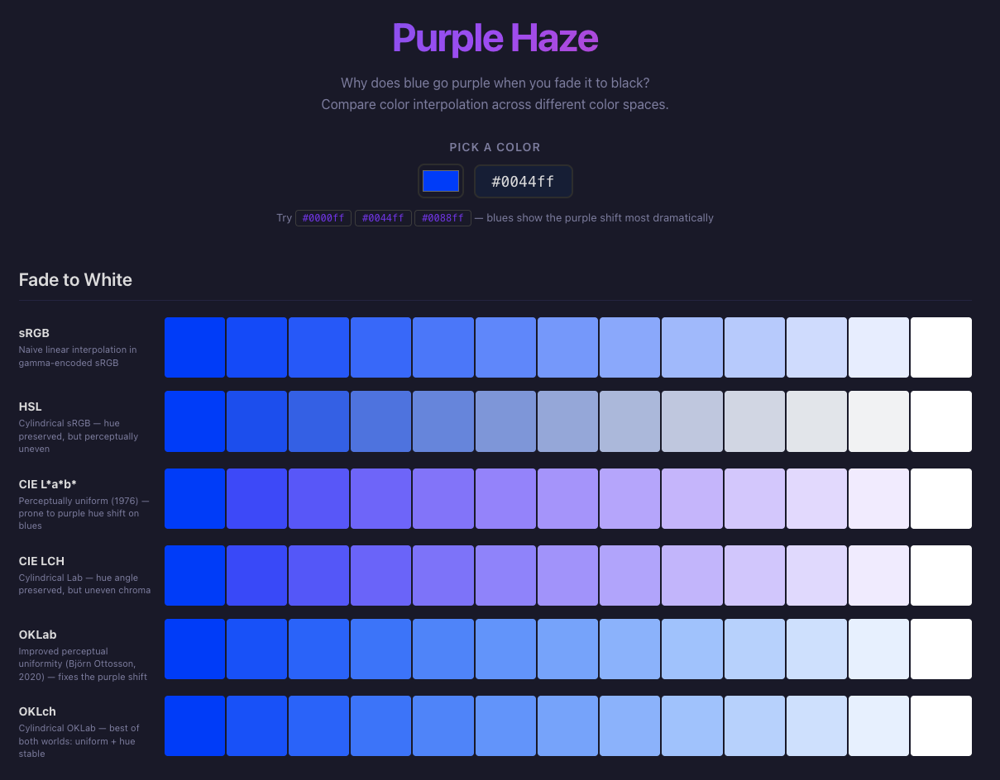

# Purple Haze



**Why does blue go purple when you fade it to black?**

Purple Haze is a visual demo that answers this question by interpolating a single color toward white and black across six different color spaces — side by side — so you can *see* the difference.

The infamous purple hue shift appears in **CIE L\*a\*b\*** (and its cylindrical form LCH) when you tween blues toward dark or light endpoints. This is a well-known artifact of that space's non-uniform hue linearity. **OKLab** (Björn Ottosson, 2020) fixes it.

This repo contains two standalone implementations of the same demo:

| | Web | Python |
|---|---|---|
| **Directory** | `purple-haze-web/` | `purple-haze-python/` |
| **Stack** | React + Vite + TypeScript | matplotlib + colour-science |
| **Color math** | [colorjs.io](https://colorjs.io) | [colour-science](https://www.colour-science.org) |
| **Interaction** | Browser-based color picker, live updates | CLI with interactive window or PNG export |

## Color spaces compared

Each implementation interpolates your chosen color to white and to black in nine color spaces:

| Space | What it is | What you'll see |
|---|---|---|
| **sRGB** | Naive linear blend in gamma-encoded RGB | Stays blue, but perceptually uneven steps |
| **HSL** | Cylindrical sRGB (hue, saturation, lightness) | Preserves hue angle, but goes pink/purple toward white |
| **CIE L\*a\*b\*** | The classic "perceptually uniform" space (1976) | Purple hue shift in the midtones — this is the bug |
| **CIE LCH** | Cylindrical form of L\*a\*b\* | Even more dramatic purple/pink drift |
| **OKLab** | Improved perceptual uniformity (Ottosson, 2020) | Hue stays true — the fix |
| **OKLch** | Cylindrical OKLab | Best of both: uniform lightness + stable hue |
| **CAM16** | CIE Color Appearance Model (2016) | Cyan drift — phantom hue on achromatic endpoints from viewing condition model |
| **HCT** | Google Material Design 3 (CAM16 hue + CIE L\* tone) | Inherits CAM16's achromatic hue artifact — cyan drift on blues |
| **Jzazbz** | HDR-ready perceptually uniform (Safdar, 2017) | Excellent hue linearity, similar to OKLab |

## Quick start — Web

```bash
cd purple-haze-web
npm install
npm run dev
```

Open [http://localhost:5173](http://localhost:5173) in your browser. Pick a color (try blues like `#0000ff`, `#0044ff`, `#0088ff`) and watch the swatch rows update live.

To build for production:

```bash
npm run build
npm run preview
```

## Quick start — Python

Requires Python 3.9+.

```bash
cd purple-haze-python
python3 -m venv .venv
source .venv/bin/activate
pip install -r requirements.txt
```

> **Note:** Modern macOS (Homebrew Python) requires a virtual environment — the commands above handle that for you. On subsequent runs you just need to activate it: `source .venv/bin/activate`

Run interactively (opens a matplotlib window):

```bash
python purple_haze.py
```

Specify a color:

```bash
python purple_haze.py "#0000ff"
```

Save to PNG instead of displaying:

```bash
python purple_haze.py "#0044ff" --save
```

This writes `purple_haze_0044ff.png` to the current directory.

## Try these colors

| Color | Hex | Why |
|---|---|---|
| Pure blue | `#0000ff` | Maximum purple shift in L\*a\*b\* |
| Azure blue | `#0044ff` | Strong shift, common in design systems |
| Sky blue | `#0088ff` | Moderate shift, still clearly visible |
| Cyan | `#00cccc` | Minimal shift — shows the effect is hue-dependent |
| Red | `#ff0000` | No purple shift — proves this is specific to blue |

## Why this matters

If you build color palettes, design systems, or work in print production, the interpolation space you choose determines whether your tints and shades stay on-hue. CIE L\*a\*b\* has been the industry standard for decades, but its hue non-linearity in the blue region produces colors that no designer intended. OKLab is the modern replacement.

## Credits

- [OKLab](https://bottosson.github.io/posts/oklab/) by Björn Ottosson
- [colorjs.io](https://colorjs.io) by Lea Verou and Chris Lilley
- [colour-science](https://www.colour-science.org) by the Colour Developers

## License

MIT
